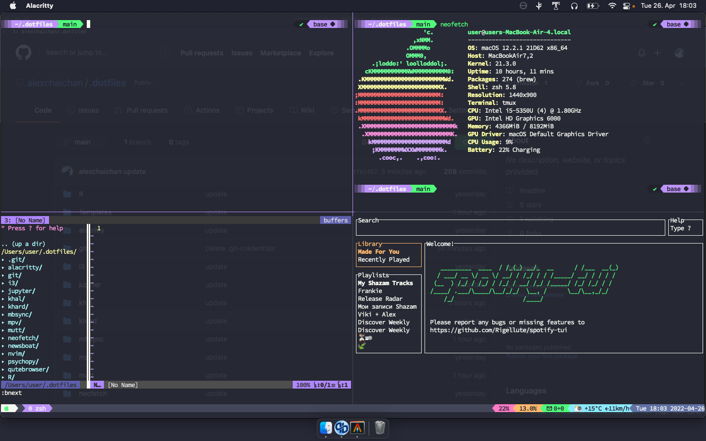

# install homebrew

`/bin/bash -c "$(curl -fsSL https://raw.githubusercontent.com/Homebrew/install/HEAD/install.sh)"`

# install git
`brew install git`

# clone the repo 

`git clone https://github.com/alexchaichan/.dotfiles.git`

# copy `.gnupg` file into `~/`

# run installation file
`source ~/.dotfiles/setup/macos/install.sh`
